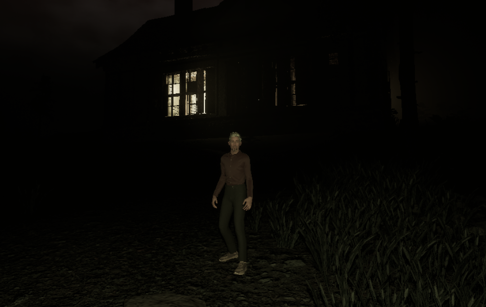
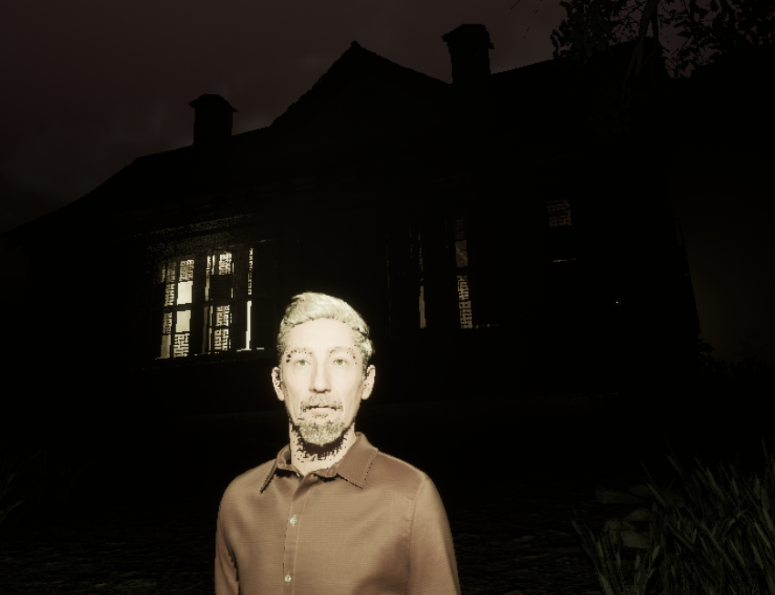
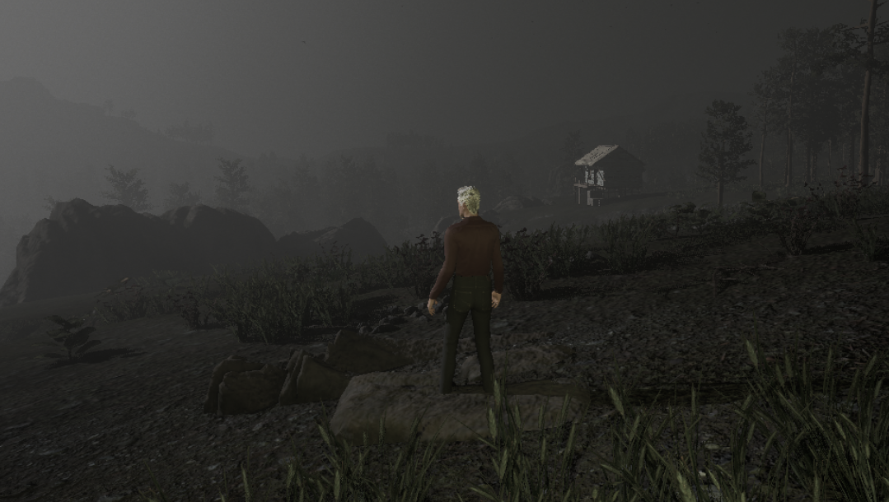

+++
title = 'Unreal MetaSound Exploration'
date = 2025-02-14T07:07:07+01:00
draft = false
+++

As part of my research into immersion within a 360 audio environment, I have been exploring FMOD within Unity but more recently weighing up whether to invest time into FMOD within Unreal. In more recent updates Unreal Engine 5 now has its own dedicated interactive sound engine, MetaSounds. I am currently exploring ways to incorporate this into a personal project. I am in the process of building a working demonstration of techniques. In the lead up to this point, I am going to test a range of applications of MetaSound blueprints and explore some field recording techniques to capture the sounds I need.

One such approach is to develop audio-led interactions in a demonstration of location-based sound triggers. So I am exploring at the moment a level designed in a forest which has sound elements that develop an atmosphere of fear within a third person/first person walking sim environment

As the purpose of this level is currently a demonstration of sound design, I wanted sufficient visuals to react to so I haven't just gone with an early block out but created this within a forest environment which has some small shacks and houses to explore dotted around the forest.

As I progress with the sound design, I am going to be adding subtle background atmos effects first such as streams, footsteps and animal sounds to build the atmosphere, distant unnerving creature sounds and weather related sounds such as wind, rain and maybe the odd rumble of thunder.

I have added a day night cycle where the day is shorter than the night in keeping with a northern hemisphere sub arctic circle ennvironment.
